# 48 штриховок для чертежей и документации

Визуальный каталог с описаниями: [catalog.html](catalog.html). Все иллюстрации встроены; подключение к сети для просмотра не требуется. Поиск и фильтр работают локально. Печать — кнопкой в каталоге.

Шесть обзорных листов: `plate_01` … `plate_06` в SVG и PNG. В папке `samples` — 48 отдельных SVG. `catalog.json` содержит описания и ссылки на конкретные исходные файлы; `inventory_127.txt` — полный перечень 127 имён из проверенной папки QCAD.

Это не полный мировой реестр. ISO/DIN регулируют оформление разрезов и линий; здесь приведены CAD-узоры, а не аттестованные нормативные знаки каждого материала. Назначение закрепляйте в легенде и спецификации. Масштаб образцов условный.

Воспроизведение и лицензии: [SOURCES.md](SOURCES.md). Для передачи агенту: [hatching-catalog-handoff.md](../../docs/hatching-catalog-handoff.md).

## Список с иллюстрациями

## Линейные узоры ANSI

### H01 · ANSI31 — Одинарная диагональная

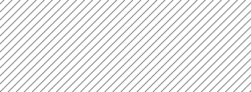

Равномерные сплошные линии под 45°. Общее обозначение сечения. Сам рисунок не определяет материал.

[Исходное CAD-определение](https://github.com/qcad/qcad/blob/master/patterns/metric/ansi31.pat)

### H02 · ANSI32 — Парная диагональная

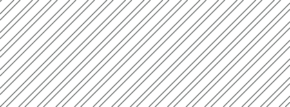

Пары линий под 45° с увеличенным промежутком между парами. В ряде CAD-библиотек связана со сталью; назначение закрепляют в легенде.

[Исходное CAD-определение](https://github.com/qcad/qcad/blob/master/patterns/metric/ansi32.pat)

### H03 · ANSI33 — Сплошная и прерывистая

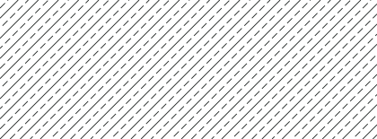

Сплошная линия чередуется с короткими штрихами под 45°. Традиционно встречается для латуни, бронзы и меди; это не код ISO.

[Исходное CAD-определение](https://github.com/qcad/qcad/blob/master/patterns/metric/ansi33.pat)

### H04 · ANSI34 — Четыре линии в группе

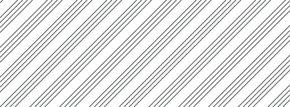

Повторяющиеся группы из четырёх параллельных линий. В CAD встречается для пластмасс и резины. Марку указывают отдельно.

[Исходное CAD-определение](https://github.com/qcad/qcad/blob/master/patterns/metric/ansi34.pat)

### H05 · ANSI35 — Диагональная с точками

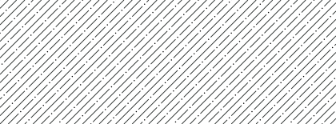

Сплошные диагонали и ряды «штрих — точка». Традиционная ассоциация с огнеупорными материалами в CAD.

[Исходное CAD-определение](https://github.com/qcad/qcad/blob/master/patterns/metric/ansi35.pat)

### H06 · ANSI36 — Смещённая штрихпунктирная

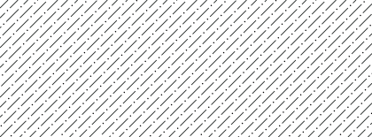

Диагональные ряды штрихов и точек со сдвигом фазы. В CAD встречается для мрамора, сланца и стекла; нужна легенда.

[Исходное CAD-определение](https://github.com/qcad/qcad/blob/master/patterns/metric/ansi36.pat)

### H07 · ANSI37 — Перекрёстная сетка

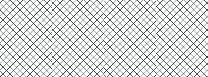

Два семейства сплошных диагоналей под 45° и 135°. В ряде CAD-библиотек — свинец, цинк, магний. Не универсальный знак.

[Исходное CAD-определение](https://github.com/qcad/qcad/blob/master/patterns/metric/ansi37.pat)

### H08 · ANSI38 — Сетка с прерывистой ветвью

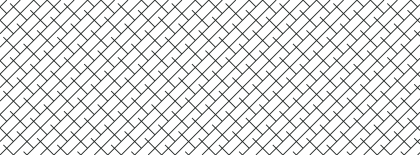

Сплошные диагонали пересекаются с прерывистыми. В CAD традиционно связывается с алюминием; материал — по спецификации.

[Исходное CAD-определение](https://github.com/qcad/qcad/blob/master/patterns/metric/ansi38.pat)

## Материальные CAD-узоры

### H09 · STEEL — Сталь: парные линии

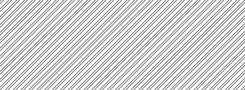

Пары диагональных линий с небольшим внутренним зазором. Материальный CAD-узор STEEL. Не заменяет указание марки стали.

[Исходное CAD-определение](https://github.com/qcad/qcad/blob/master/patterns/metric/steel.pat)

### H10 · BRASS — Латунь: полосы и штрихи

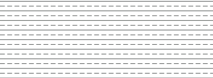

Горизонтальные сплошные и прерывистые ряды. Материальный CAD-узор BRASS для легенд и сечений.

[Исходное CAD-определение](https://github.com/qcad/qcad/blob/master/patterns/metric/brass.pat)

### H11 · PLAST — Пластик: тройные полосы

Группы из трёх близких горизонтальных линий. Материальный CAD-узор PLAST. Состав полимера из рисунка не следует.

[Исходное CAD-определение](https://github.com/qcad/qcad/blob/master/patterns/metric/plast.pat)

### H12 · PLASTI — Пластик: полосы с разделителем

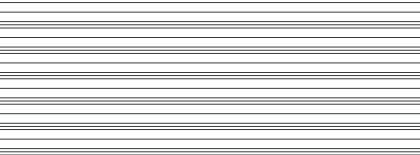

Тройная группа и отдельная линия в каждом периоде. Вариант PLASTI; выбирается правилами конкретной документации.

[Исходное CAD-определение](https://github.com/qcad/qcad/blob/master/patterns/metric/plasti.pat)

### H13 · CORK — Пробка

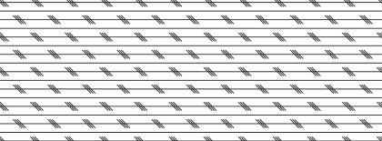

Горизонтальные линии с группами коротких наклонных штрихов. Условное изображение пробкового материала в CAD.

[Исходное CAD-определение](https://github.com/qcad/qcad/blob/master/patterns/metric/cork.pat)

### H14 · INSUL — Изоляция

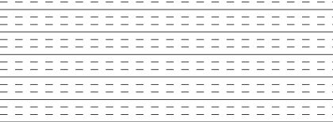

Сплошной горизонтальный ряд и два прерывистых ряда. CAD-узор INSUL для изоляционных слоёв, с пояснением материала.

[Исходное CAD-определение](https://github.com/qcad/qcad/blob/master/patterns/metric/insul.pat)

### H15 · FLEX — Гибкий материал

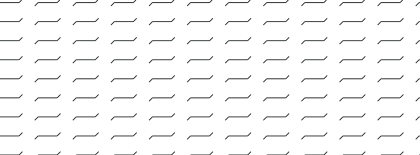

Разорванные горизонтали с короткими наклонными соединениями. Условная фактура гибкой прослойки или вставки. Не знак конкретного полимера.

[Исходное CAD-определение](https://github.com/qcad/qcad/blob/master/patterns/metric/flex.pat)

### H16 · JIS_WOOD — Древесина: JIS_WOOD

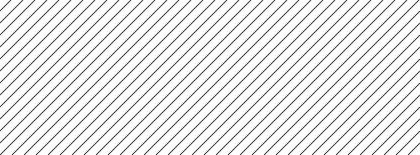

Простая равномерная диагональная штриховка. Имя из CAD-библиотеки с префиксом JIS. Это не рисунок годичных колец.

[Исходное CAD-определение](https://github.com/qcad/qcad/blob/master/patterns/metric/jis_wood.pat)

## Грунты и заполнители

### H17 · AR-CONC — Бетон

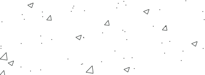

Нерегулярное сочетание треугольных включений, точек и штрихов. Архитектурный CAD-узор бетонного заполнителя.

[Исходное CAD-определение](https://github.com/qcad/qcad/blob/master/patterns/metric/ar-conc.pat)

### H18 · AR-SAND — Песок

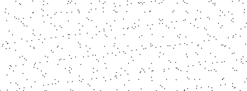

Точки с неодинаковыми интервалами и смещением рядов. Зернистые засыпки и песчаные слои на строительных деталях.

[Исходное CAD-определение](https://github.com/qcad/qcad/blob/master/patterns/metric/ar-sand.pat)

### H19 · EARTH — Грунт

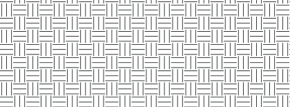

Чередующиеся группы коротких горизонтальных и вертикальных штрихов. Земля и грунтовые слои; конкретный вид грунта задают подписью.

[Исходное CAD-определение](https://github.com/qcad/qcad/blob/master/patterns/metric/earth.pat)

### H20 · GRAVEL — Гравий

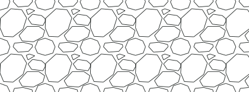

Нерегулярные замкнутые угловатые фрагменты. Гравийная засыпка и крупный заполнитель.

[Исходное CAD-определение](https://github.com/qcad/qcad/blob/master/patterns/metric/gravel.pat)

### H21 · CLAY — Глина

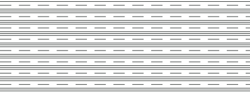

Группы горизонтальных сплошных линий и отдельный штриховой ряд. Глинистый материал в условной CAD-легенде.

[Исходное CAD-определение](https://github.com/qcad/qcad/blob/master/patterns/metric/clay.pat)

### H22 · DOLMIT — Доломит

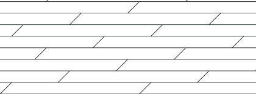

Горизонтальные слои и редкие наклонные короткие штрихи. Геологическая или строительная легенда для доломита.

[Исходное CAD-определение](https://github.com/qcad/qcad/blob/master/patterns/metric/dolmit.pat)

### H23 · MUDST — Аргиллит / глинистая порода

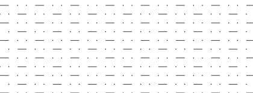

Горизонтальные штрихи и точки в смещённых рядах. Узор MUDST для схем слоистых осадочных пород.

[Исходное CAD-определение](https://github.com/qcad/qcad/blob/master/patterns/metric/mudst.pat)

### H24 · GRASS — Травяной покров

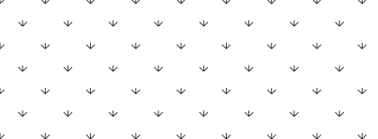

Трёхлучевые группы коротких штрихов. Озеленение и условное изображение травы на планах.

[Исходное CAD-определение](https://github.com/qcad/qcad/blob/master/patterns/metric/grass.pat)

## Кладка и мощение

### H25 · BRICK — Кирпичная кладка

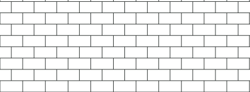

Прямоугольные ряды со смещением поперечных швов. Условная кладка; геометрия образца не задаёт размер кирпича.

[Исходное CAD-определение](https://github.com/qcad/qcad/blob/master/patterns/metric/brick.pat)

### H26 · BRSTONE — Полосовая каменная кладка

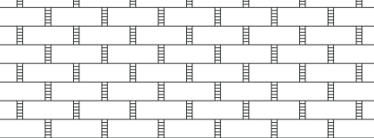

Горизонтальные ряды, парные вертикальные грани и короткая фактура. CAD-узор BRSTONE для каменной облицовки и кладки.

[Исходное CAD-определение](https://github.com/qcad/qcad/blob/master/patterns/metric/brstone.pat)

### H27 · AR-B816 — Блоки 8 × 16: контур

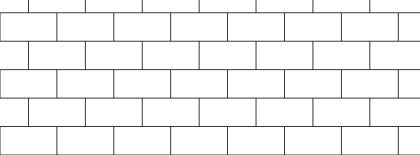

Крупные прямоугольные ряды с перевязкой. Архитектурный модуль с номинальным именем 8 × 16 дюймов.

[Исходное CAD-определение](https://github.com/qcad/qcad/blob/master/patterns/metric/ar-b816.pat)

### H28 · AR-B816C — Блоки 8 × 16: со швом

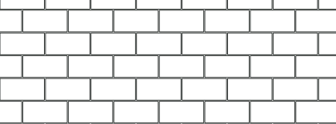

Перевязка прямоугольных блоков с видимой шириной швов. Вариант AR-B816C; растворные швы читаются отдельными зазорами.

[Исходное CAD-определение](https://github.com/qcad/qcad/blob/master/patterns/metric/ar-b816c.pat)

### H29 · AR-B88 — Блоки 8 × 8

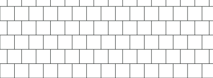

Квадратные модули со смещёнными стыками рядов. Архитектурный CAD-узор для блочной кладки.

[Исходное CAD-определение](https://github.com/qcad/qcad/blob/master/patterns/metric/ar-b88.pat)

### H30 · AR-BRELM — Английская перевязка

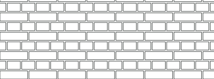

Чередование длинных и коротких модулей с растворными швами. Условное изображение английской кирпичной перевязки.

[Исходное CAD-определение](https://github.com/qcad/qcad/blob/master/patterns/metric/ar-brelm.pat)

### H31 · AR-BRSTD — Обычная кирпичная перевязка

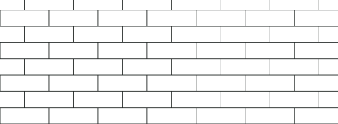

Узкие горизонтальные ряды с регулярным смещением вертикальных швов. Архитектурный CAD-образец кирпичной кладки.

[Исходное CAD-определение](https://github.com/qcad/qcad/blob/master/patterns/metric/ar-brstd.pat)

### H32 · AR-HBONE — Кладка «ёлочкой»

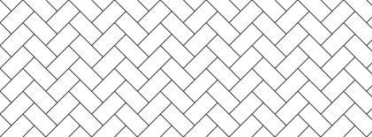

Взаимно перпендикулярные вытянутые элементы под 45°. Мощение и укладка прямоугольных элементов «ёлочкой».

[Исходное CAD-определение](https://github.com/qcad/qcad/blob/master/patterns/metric/ar-hbone.pat)

## Покрытия и базовые сетки

### H33 · AR-PARQ1 — Квадратный паркет

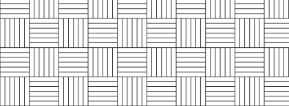

Блоки параллельных планок с чередованием направления на 90°. Условное изображение паркетного покрытия.

[Исходное CAD-определение](https://github.com/qcad/qcad/blob/master/patterns/metric/ar-parq1.pat)

### H34 · AR-RROOF — Кровля: нерегулярные ряды

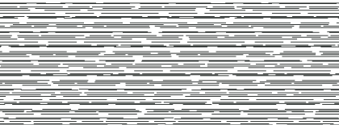

Прерывистые горизонтальные линии разной длины и шага. Условная фактура кровельной поверхности; система определяется легендой.

[Исходное CAD-определение](https://github.com/qcad/qcad/blob/master/patterns/metric/ar-rroof.pat)

### H35 · AR-RSHKE — Кровельный гонт

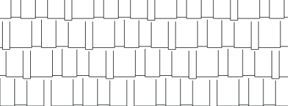

Неравномерные узкие элементы со смещёнными горизонтальными кромками. Условное изображение деревянного гонта или дранки.

[Исходное CAD-определение](https://github.com/qcad/qcad/blob/master/patterns/metric/ar-rshke.pat)

### H36 · LINE — Параллельные горизонтали

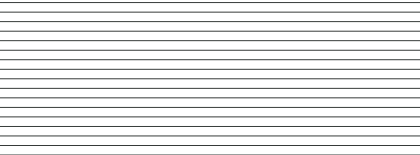

Одно семейство равномерных сплошных линий. Нейтральная заливка области, направление слоёв или полос.

[Исходное CAD-определение](https://github.com/qcad/qcad/blob/master/patterns/metric/line.pat)

### H37 · NET — Прямоугольная сетка

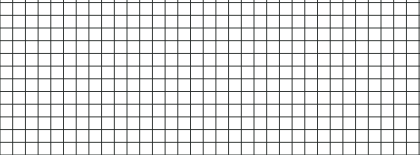

Горизонтальные и вертикальные линии с одинаковым шагом. Сетка, модульное покрытие или различение зон по легенде.

[Исходное CAD-определение](https://github.com/qcad/qcad/blob/master/patterns/metric/net.pat)

### H38 · NET3 — Треугольная сетка

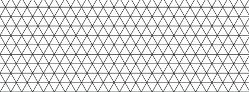

Три семейства линий: 0°, 60° и 120°. Треугольная ячеистая структура или нейтральная зональная заливка.

[Исходное CAD-определение](https://github.com/qcad/qcad/blob/master/patterns/metric/net3.pat)

### H39 · DOTS — Регулярные точки

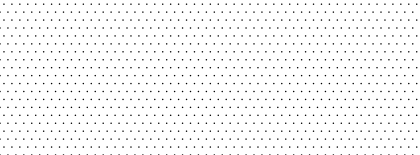

Равномерная точечная решётка со смещением рядов. Нейтральная фактура; не определяет зернистость реального материала.

[Исходное CAD-определение](https://github.com/qcad/qcad/blob/master/patterns/metric/dots.pat)

### H40 · CROSS — Крестики

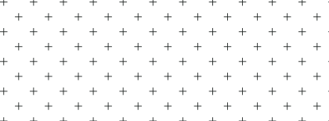

Повторяющиеся изолированные кресты. Зональное выделение или специальная легенда документа.

[Исходное CAD-определение](https://github.com/qcad/qcad/blob/master/patterns/metric/cross.pat)

## Геометрические узоры

### H41 · DASH — Короткие штрихи

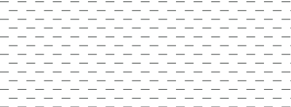

Горизонтальные штриховые ряды со сдвигом. Нейтральная условная заливка или обозначение зоны.

[Исходное CAD-определение](https://github.com/qcad/qcad/blob/master/patterns/metric/dash.pat)

### H42 · ANGLE — Уголки

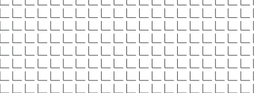

Повторяющиеся прямые углы из двух коротких отрезков. Геометрическая фактура для различения областей.

[Исходное CAD-определение](https://github.com/qcad/qcad/blob/master/patterns/metric/angle.pat)

### H43 · GRATE — Прямоугольная решётка

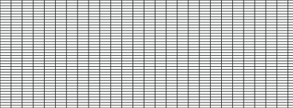

Плотные горизонтальные и более редкие вертикальные линии. Условное изображение решётчатой поверхности.

[Исходное CAD-определение](https://github.com/qcad/qcad/blob/master/patterns/metric/grate.pat)

### H44 · HEX — Раздельные шестигранники

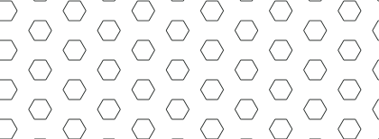

Шестиугольные фигуры с промежутками между ними. Геометрический узор; материал назначается легендой.

[Исходное CAD-определение](https://github.com/qcad/qcad/blob/master/patterns/metric/hex.pat)

### H45 · HONEY — Сотовая структура

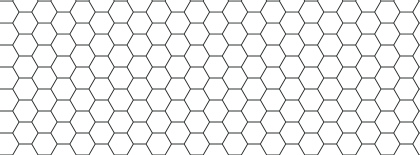

Смежные шестигранные ячейки. Условная сотовая поверхность или структура заполнителя.

[Исходное CAD-определение](https://github.com/qcad/qcad/blob/master/patterns/metric/honey.pat)

### H46 · SQUARE — Раздельные квадраты

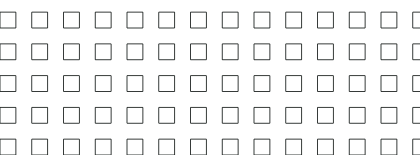

Квадраты, составленные из ортогональных штрихов. Геометрический CAD-узор, не знак конкретного материала.

[Исходное CAD-определение](https://github.com/qcad/qcad/blob/master/patterns/metric/square.pat)

### H47 · TRIANG — Раздельные треугольники

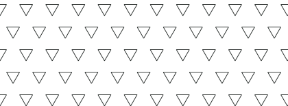

Повторяющиеся треугольные контуры. Нейтральный рисунок для области или структуры.

[Исходное CAD-определение](https://github.com/qcad/qcad/blob/master/patterns/metric/triang.pat)

### H48 · ZIGZAG — Ступенчатый зигзаг

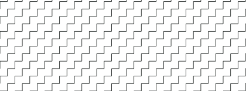

Соединённые горизонтальные и вертикальные штрихи. Геометрический CAD-узор; назначение задаётся в легенде.

[Исходное CAD-определение](https://github.com/qcad/qcad/blob/master/patterns/metric/zigzag.pat)

## Источники и пределы

Геометрия: [QCAD metric patterns](https://github.com/qcad/qcad/tree/master/patterns/metric). Проверка перечня и исходных определений выполнена 26.09.2026. Исходные PAT-определения включены в `hatch_sources.json` вместе со ссылками и контрольными SHA. Условия, происхождение и команды — в [SOURCES.md](SOURCES.md).

Лицензионное уведомление QCAD: [LICENSE.txt](https://github.com/qcad/qcad/blob/master/LICENSE.txt), [GPL-3.0](https://github.com/qcad/qcad/blob/master/gpl-3.0.txt). Автор исходных определений: проект QCAD / соответствующие правообладатели.

Нормативные ориентиры: ISO 128-2 / DIN EN ISO 128-2; ISO 128-3 / DIN EN ISO 128-3; отдельно ГОСТ 2.306-68 для ЕСКД. Полные тексты ISO/DIN недоступны в этой сессии. Оригиналы ANSI/JIS не проверялись; префиксы ANSI/JIS в этом справочнике — имена CAD-файлов.

Нет общего правила, назначающего титану, меди, стеклу или изоляционной ленте уникальный международный узор. Соседние детали различают направлением и шагом; материал задаётся также текстом. Карта, разрез здания, машиностроительный чертёж и пояснительный рисунок требуют разных легенд.