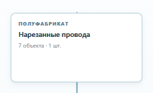
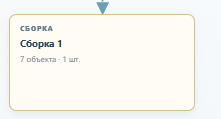
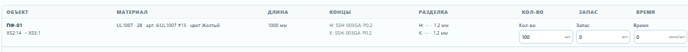

# Референс дизайна «Маршрут v2»

Источник визуального языка — приложенные владельцем C1–C3 и существующий экран
`RouteV2Panel`. Референс описывает состояние после выбора карточки.

## Карточки и связи

- Карточка полуфабриката сохраняет голубую рамку и белый фон из C1.
- Карточка сборки сохраняет тёплую рамку и кремовый фон из C2.
- В правом верхнем углу карточки появляется компактный крестик удаления. Он
  имеет `aria-label`, не запускает drag карточки и всегда требует подтверждения.
- Связь остаётся пунктирной стрелкой. На стрелке доступен небольшой
  маркер удаления; клик по маркеру просит подтверждение и удаляет только связь.

## Настройки карточки

Настройки открываются отдельным широким модальным окном: таблица C3 требует
больше места, чем прежний боковой инспектор. После заголовка идут имя, количество,
кнопка редактора рисунка и таблица C3. В таблице отображаются все refs
карточки: объект, материал, длина, концы, разделка, кол-во, запас и время.
Для полей, которых нет в Route v2, используется `—`, без расчётов.

Под таблицей идёт сетка миниатюр. Для проводов и оболочек используется их
реальный рисунок из текущего документа, для сборки — сохранённая копия рисунка
или изолированный фрагмент. Клик по миниатюре открывает затемнённый popup;
клик в любой точке popup закрывает его.

## Выбор состава

Связь задаёт зависимость карточек и не добавляет refs автоматически. Состав
выбирается только в настройках целевой карточки; выбранные refs отображаются
в таблице и сохраняются в localStorage вместе с графом.
