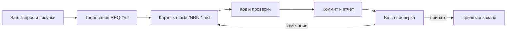

# Как вести разработку TECHMAP-GRAPHER с Codex

Практический путеводитель для владельца проекта. Его можно уточнять по мере работы. Обязательные правила для исполнителей находятся в [AGENTS.md](../AGENTS.md) и [порядке ведения проекта](project-workflow.md); этот документ помогает быстро выбрать правильное действие.

**Последнее обновление:** 30.09.2026.

## За 30 секунд

1. Напишите задачу обычными словами в чате, относящемся к этой работе. Приложите рисунки и укажите, что на них видно и какого результата вы ждёте.
2. Попросите Codex найти связанные требования, обновить нужные документы, оформить ограниченную карточку в `tasks/`, выполнить работу и проверить её. Делать это можно в **одном чате и одним поручением**.
3. Исправления результата отправляйте в тот же чат, пока не завершена эта задача. Для другой самостоятельной задачи создавайте новый чат.
4. Смотрите на проверяемый результат: поведение программы, тесты, изменённые файлы, коммит и ограничения. Проход тестов ещё не означает вашу ручную приёмку.

## Где хранится информация

| Нужно узнать или изменить | Основное место | Что там записывать |
| --- | --- | --- |
| Как **должен работать** продукт | [Требования](requirements.md) | Действующее ожидаемое поведение с постоянным `REQ-###` и источником. Это не перечень всех промптов. |
| Что **сделать сейчас** | [Очередь задач](../tasks/README.md) и карточка по [шаблону](../tasks/_template.md) | Границы работы, связанные требования, владелец файлов, критерии приёмки и проверки. |
| Почему принято техническое решение | [ADR](decisions/README.md) | Контекст, решение и последствия существенного выбора. |
| Как устроен текущий код | [Архитектура](architecture.md) | Подтверждённая структура и связи модулей. |
| Что действительно проверено | [Статус](../status.md) | Последний датированный проверенный срез, а не обещание будущего результата. |
| Как работать и поставлять результат | [Порядок работы](project-workflow.md) | Правила Git, параллельной работы, приёмки и ZIP. |

**Вы можете не редактировать эти файлы вручную.** Достаточно поставить задачу в чате и поручить Codex обновить нужные места. Он должен отличать ваш новый запрос от предположения и от поведения, восстановленного по коду. Если требование изменилось, в документе остаётся его актуальная формулировка; прежняя версия сохраняется в истории Git.

## Куда отправлять новую задачу

**Одна связная работа — один чат.** Например, положение таблицы соединений и последующие исправления её положения ведутся вместе. Новый состав столбцов или экспорт — отдельная работа и, как правило, отдельный чат. Общий чат для переноса каждой задачи не нужен: общим контекстом служат файлы проекта и Git.

Попросите Codex в том же чате сначала найти нужные `REQ-###` и ADR, создать или обновить карточку и затем выполнить её. Не требуется вторым сообщением напоминать ему «ссылайся на свои задачи». Если вы хотите сначала проверить формулировку, явно ограничьте первый этап: «Пока только оформи требования и карточку, код не меняй». После просмотра продолжите **в этом же чате**: «Выполни карточку NNN».

**Параллельная работа:** два чата в одной локальной папке могут менять одни и те же файлы. Для независимых параллельных изменений используйте разные Git worktree и назначайте владельцев файлов. Субагенты полезны для ограниченного независимого анализа, тестов и ревью внутри одной задачи; одновременную запись в общие файлы нужно координировать.

## Как поставить задачу с рисунками

1. Сделайте скриншот проблемного места или простой эскиз желаемого вида. Отметьте стрелкой или рамкой важную область. Красивый макет не обязателен.
2. Приложите изображения к сообщению и назовите их `C1`, `C2` и далее. В приложении изображение можно перетащить в поле сообщения, удерживая `Shift`.
3. Для каждого рисунка напишите: **что видно сейчас**, **что ожидается**, **как проверить**. Рисунок дополняет текст, но не заменяет его.
4. Если изображение потребуется в другом чате или worktree, сохраните его в проекте, например `design/references/connection-table/C1-before.png`, и укажите путь в карточке. Вложение одного чата не является общим файлом проекта.

Пример поручения:

> Таблица соединений перекрывает плашку на C1. Ожидаю расположение как на C2: таблица начинается под плашкой и не перекрывает её при изменении ширины окна. Оцени C1 и C2, найди связанные требования, обнови их при необходимости, оформи карточку по `tasks/_template.md`, исправь только положение таблицы и проверь результат на двух ширинах окна. Сообщи изменённые файлы, проверки, коммит и ограничения.

Если рисунок показывает только дефект, Codex должен исследовать причину; не следует превращать каждый пиксель скриншота в требование. Если рисунок задаёт новое постоянное поведение, его нужно описать текстом в `docs/requirements.md` и связать с карточкой.

## Как вносить корректировки

Пишите замечание в том же чате, где выполнялась работа:

> На C3 после исправления таблица всё ещё перекрывает плашку при ширине окна 1280 px. Ожидаю отступ 8 px и отсутствие перекрытия при 1280 и 1920 px. Продолжи эту же карточку, найди причину, исправь и покажи результат. Состав столбцов не меняй.

Дальше есть три случая:

| Причина расхождения | Что должен сделать Codex |
| --- | --- |
| Требование было ясным, код ему не соответствует | Исправить реализацию и необходимые проверки; требование не переписывать. |
| Требование допускало разные трактовки | Уточнить его по вашему сообщению, исправить карточку, код и проверки. |
| Вы решили изменить ожидаемое поведение | Обновить действующее требование и карточку как изменение объёма, затем выполнить его. |

При уточнении не создают вторую противоречащую копию пункта: изменяют действующий `REQ-###` или добавляют новый пункт, если это отдельное правило. Существенное изменение архитектуры фиксируют в ADR. Незавершённую карточку не объявляют принятой из-за одного успешного теста.

## Что делает Codex, а что проверяете вы

| Codex | Владелец проекта |
| --- | --- |
| Исследует код и документы, оформляет требования и карточку, реализует изменение. | Объясняет желаемый результат и проверяет, подходит ли он в реальном сценарии. |
| Сверяет `C1`, `C2` с наблюдаемым поведением; запускает нужные проверки. | Указывает расхождения и решает спорные продуктовые вопросы. |
| Коммитит проверенный законченный срез и сообщает хеш, проверки и ограничения. | Принимает результат после просмотра; автоматические тесты не подменяют приёмку. |

Codex не должен молча выдавать предположение или обнаруженное в коде поведение за утверждённое вами требование. Когда безопасное допущение позволяет продолжить, он выполняет доступную часть и явно отмечает допущение. Если выбор существенно меняет продукт и без него нельзя продолжить, он формулирует конкретный вопрос.

## Готовые формулировки

**Новая работа — сразу до результата:**

> Реализуй [желаемый результат]. Приложены C1 и C2: [что на каждом]. Найди связанные требования и решения, обнови нужные документы, создай или обнови одну карточку с критериями приёмки, выполни её в установленной области файлов, проверь результат. Сообщи коммит, проверки и ограничения.

**Сначала только уточнить постановку:**

> Проанализируй [идею] и C1. Пока не меняй код. Оформи действующие требования и одну ограниченную карточку; явно пометь неподтверждённые предположения и пробелы данных.

**Продолжить после вашей проверки:**

> Продолжи карточку NNN. Фактически [что произошло, ссылка на C3]. Ожидаю [проверяемое поведение]. Исправь в пределах этой карточки и повтори проверку.

**Передача работы в другой чат:**

> Выполни `tasks/NNN-*.md`. Прочитай связанные `REQ-###`, ADR и сохранённые в проекте рисунки. Проверь актуальное состояние Git и владельцев файлов. Сообщи результат по критериям карточки.

## Завершение и дальнейшее обновление этого руководства

Карточка проходит путь `backlog → ready → in-progress → ready-for-review → accepted`. `ready-for-review` означает, что работа проверена и зафиксирована; `accepted` означает вашу приёмку или заранее согласованный критерий. После завершения чат можно архивировать, если он больше не нужен для исправлений. Сначала убедитесь, что нужные изменения сохранены в Git: архивирование чата с управляемым worktree может убрать активную рабочую копию.

Если этот порядок окажется неудобным, попросите Codex обновить **этот** документ: укажите конкретный сценарий, что было непонятно и какое правило нужно уточнить. Изменение действующих обязательных правил одновременно отражается в [порядке работы](project-workflow.md) или [AGENTS.md](../AGENTS.md), чтобы учебный текст им не противоречил.
